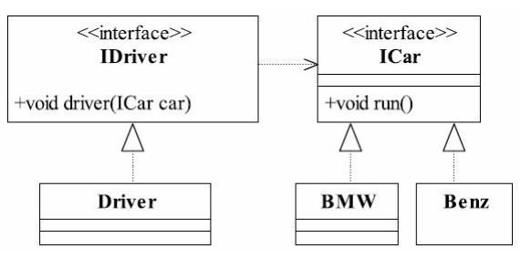

## 设计模式复盘


#### 掌握设计模式的层次
1. 第1层:刚开始学编程不久,听说过什么是设计模式
2. 第2层:有很长时间的编程经验,自己写了很多代码,其中用到了设计模式,但是自己却不知道
3. 第3层:学习过了设计模式,发现自己已经在使用了,并且发现了一些新的模式挺好用的
4. 第4层:**阅读了很多别人写的源码和框架,在其中看到别人设计模式,并且能够领会设计模式的精妙和带来的好处**。
5. 第5层：代码写着写着,自己都没有意识到使了设计模式,并且熟练的写了出来


#### 设计模式概述
是对软件设计中普遍存在(反复出现)的各种问题,所提出的解决方案。

#### 学习设计模式目的
编写软件过程中，程序员面临着来自耦合性，内聚性以及可维护性，可扩展性，重用性，灵活性等多方面的挑战，
设计模式是为了让软件具有更好的
1. 代码重用性(即:相同功能的代码,不用多次编写)
2. 可读性(即:编程规范性,便于其他程序员的阅读和理解)
3. 可扩展性(即: 当需要增加新的功能时,非常的方便,称为可维护)
4. 可靠性(即:当我们增加新的功能后,对原来的功能没有影响)
5. 使程序呈现高内聚,低耦合的特性

##设计模式7大原则
1. 单一职责原则
2. 接口隔离原则
3. 依赖倒转原则
4. 里氏替换原则
5. 开闭原则
6. 迪米特法则
7. 合成复用原则


####  单一职责原则
对类来说的，即一个类应该只负责一项职责。如果类A负责两个不同的职责：职责1，职责2。当职责1需求变更而改变A时。可能造成职责2执行错误，所以需要将类的粒度分解为A1，A2。

单一职责原则的注意事项和细节
1. 降低类的复杂度，一个类只负责一项职责
2. 提高类的可读性，可维护性
3. 降低变更引起的风险
4. 通常情况下，我们应当遵守单一职责原则，只有逻辑足够简单，才可以在代码级别违反单一职责原则；只有类中方法数量足够少，可以在方法级别保持单一职责原则
 
 
 #### 接口隔离原则定义如下：
- 客户端不应该依赖它不需要的接口
- 类间的依赖关系应该建立在最小的接口上
 
 
 
 ```
 public class Segregation1 {
 
     public static void main(String[] args) {
 
         A a = new A();
         a.dependency1(new B());
         a.dependency2(new B());
         a.dependency3(new B());
         C c = new C();
         c.dependency1(new D());
         c.dependency4(new D());
         c.dependency5(new D());
 
     }
 
 }
 
 interface Interface1 {
     void operation1();
 
     void operation2();
 
     void operation3();
 
     void operation4();
 
     void operation5();
 }
 
 class B implements Interface1 {
     @Override
     public void operation1() {
         System.out.println("B 实现了 operation1");
     }
 
     @Override
     public void operation2() {
         System.out.println("B 实现了 operation2");
     }
 
     @Override
     public void operation3() {
         System.out.println("B 实现了 operation3");
     }
 
     @Override
     public void operation4() {
         System.out.println("B 实现了 operation4");
     }
 
     @Override
     public void operation5() {
         System.out.println("B 实现了 operation5");
     }
 }
 
 
 class D implements Interface1 {
     @Override
     public void operation1() {
         System.out.println("D 实现了 operation1");
     }
 
     @Override
     public void operation2() {
         System.out.println("D 实现了 operation2");
     }
 
     @Override
     public void operation3() {
         System.out.println("D 实现了 operation3");
     }
 
     @Override
     public void operation4() {
         System.out.println("D 实现了 operation4");
     }
 
     @Override
     public void operation5() {
         System.out.println("D 实现了 operation5");
     }
 }
 
 class A {
     public void dependency1(Interface1 i) {
         i.operation1();
     }
 
     public void dependency2(Interface1 i) {
         i.operation2();
     }
 
     public void dependency3(Interface1 i) {
         i.operation3();
     }
 }
 
 
 class C {
     public void dependency1(Interface1 i) {
         i.operation1();
     }
 
     public void dependency4(Interface1 i) {
         i.operation4();
     }
 
     public void dependency5(Interface1 i) {
         i.operation5();
     }
 }
 ```
 
 ```
 B 实现了 operation1
 B 实现了 operation2
 B 实现了 operation3
 D 实现了 operation1
 D 实现了 operation4
 D 实现了 operation5
 ```
 应该这个样子
 
 
 
 ```
 package com.evan.segregation;
 
 /**
  * @Description
  * @ClassName Segregation1
  * @Author Evan
  * @date 2019.11.25 22:56
  */
 public class Segregation2 {
 
     public static void main(String[] args) {
 
         A a = new A();
         a.dependency1(new B());
         a.dependency2(new B());
         a.dependency3(new B());
         C c = new C();
         c.dependency1(new D());
         c.dependency4(new D());
         c.dependency5(new D());
 
     }
 
 }
 
 interface Interface1 {
     void operation1();
 
 }
 
 interface Interface2 {
     void operation2();
 
     void operation3();
 
 }
 
 interface Interface3 {
     void operation4();
 
     void operation5();
 }
 
 class B implements Interface1, Interface2 {
     @Override
     public void operation1() {
         System.out.println("B 实现了 operation1");
     }
 
     @Override
     public void operation2() {
         System.out.println("B 实现了 operation2");
     }
 
     @Override
     public void operation3() {
         System.out.println("B 实现了 operation3");
     }
 }
 
 
 class D implements Interface1, Interface3 {
     @Override
     public void operation1() {
         System.out.println("D 实现了 operation1");
     }
 
     @Override
     public void operation4() {
         System.out.println("D 实现了 operation4");
     }
 
     @Override
     public void operation5() {
         System.out.println("D 实现了 operation5");
     }
 }
 
 class A {
     public void dependency1(Interface1 i) {
         i.operation1();
     }
 
     public void dependency2(Interface2 i) {
         i.operation2();
     }
 
     public void dependency3(Interface2 i) {
         i.operation3();
     }
 }
 
 
 class C {
     public void dependency1(Interface1 i) {
         i.operation1();
     }
 
     public void dependency4(Interface3 i) {
         i.operation4();
     }
 
     public void dependency5(Interface3 i) {
         i.operation5();
     }
 }
 ```
 
#### 依赖倒转原则

依赖倒转原则(Dependence Inversion Principle)是指:

1. 高层模块不应该依赖低层模块,二者都应该依赖其抽象
2. 抽象不应该依赖细节
3. 细节应该依赖抽象
4. 依赖倒转(倒置)的中心思想是面向接口编程
5. 依赖倒转原则是基于这样的设计理念:**相对于细节的多变性,抽象的东西要稳定的多** 。以抽象为基础搭建的架构比以细节为基础的架构要稳定的多。在java中,抽象指的是接口或抽象类,细节就是具体的实现类
6. 使用接口或抽象类的目的是制定好规范,而不涉及任何具体的操作,把展现细节的任务交给他们的实现类去完成
7. 采用依赖倒置原则可以减少类间的耦合性，降低并行开发引起的风险，提高代码的可读性和可维护性。


##### 完成Person接受消息的功能
```
public class DependecyInversion1 {
    public static void main(String[] args) {
        Person person = new Person();
        person.receive(new Email());
    }
}

class Email {
    public String getInfo() {
        return "电子邮件: hello world";
    }
}
// 完成Person接收消息的功能

class Person {
    public void receive(Email email) {
        System.out.println(email.getInfo());
    }
}

```

 public void receive(Email email) 如果我们获取的对象时微信，短信等，则需要增加类，同事Person也要增加相应接收的方法
 
改进方法
引入一个抽象的接口IReceiver,表示接受者，这样Person与接口IReceiver发生依赖。

```
public class DependecyInversion2 {
    public static void main(String[] args) {
        Person person = new Person();
        person.receive(new Email());

        person.receive(new Wechat());
    }
}

 interface IRecever {
    String getInfo();
}

class Email implements IRecever{
    public String getInfo() {
        return "电子邮件: hello world";
    }
}

class Wechat implements IRecever{
    public String getInfo() {
        return "Wechat: hello world";
    }
}
// 完成Person接收消息的功能
class Person {
    public void receive(IRecever receiver) {
        System.out.println(receiver.getInfo());
    }
}

```

##### 依赖关系传递的三种方式和应用案例
1. 接口传递
2. 构造方法传递
3. setter方式传递


###### 接口传递

```
package com.evan.inversion;

public interface ICar {

    default void run() {
        System.out.println("老子是车，肯定会跑呀");
    }

    void name();
}


package com.evan.inversion;

public interface IDriver {

    void driver(ICar car);
}


package com.evan.inversion;

public class Client {

    public static void main(String[] args) {
        Driver driver = new Driver();
        driver.driver(new Benz());
        System.out.println("-----------");
        driver.driver(new WuLin());
    }
}

```


###### 构造方法传递
```
package com.evan.mysqltest;

public class DepencyMain {
    public static void main(String[] args) {
        MITV mi = new MITV();
        OpenAndClose openAndClose = new OpenAndClose();
        openAndClose.open(mi);
    }
}


class MITV implements ITV{

    @Override
    public void play() {
        System.out.println("打开了小米电视机");
    }
}

// 通过接口传递依赖
interface IOpenAndClose{
    public void open(ITV itv);
}

interface ITV{
    public void play();
}

class OpenAndClose implements IOpenAndClose{
    @Override
    public void open(ITV itv) {
        itv.play();
    }
}
```

```
package com.evan.mysqltest;

public class DepencyMain {
    public static void main(String[] args) {
        MITV mi = new MITV();
        OpenAndClose openAndClose = new OpenAndClose(mi);
        openAndClose.open();
    }
}


class MITV implements ITV{

    @Override
    public void play() {
        System.out.println("打开了小米电视机");
    }
}

// 通过构造方法实现依赖
interface IOpenAndClose {
    public void open();
}

interface ITV {
    public void play();
}

class OpenAndClose implements IOpenAndClose {

    public ITV itv;

    public OpenAndClose(ITV itv) {
        this.itv = itv;
    }

    @Override
    public void open() {
      this.itv.play();
    }
}
```


###### setter方式传递
```
package com.evan.mysqltest;

public class DepencyMain {
    public static void main(String[] args) {
        MITV mi = new MITV();
        OpenAndClose openAndClose = new OpenAndClose();
        openAndClose.setItv(mi);
        openAndClose.open();
    }
}


class MITV implements ITV {

    @Override
    public void play() {
        System.out.println("打开了小米电视机");
    }
}

// 通过setter方法
interface IOpenAndClose {
    public void open();
}

interface ITV {
    public void play();
}

class OpenAndClose implements IOpenAndClose {

    public ITV itv;

    public void setItv(ITV itv) {
        this.itv = itv;
    }

    @Override
    public void open() {
        this.itv.play();
    }
}


```


##### 依赖倒转原则的注意事项
1. 低层模块尽量都要有抽象类或者接口，或者两者都有，程序稳定性更好
2. 变量的声明类型尽量是抽象类或接口，这样我们的变量引用和实际对象间，就存在一个缓冲层，利于程序扩展和优化
3. 继承时遵守里氏替换原则


##### 依赖倒转原则 深入理解
依赖倒置原则的本质就是通过抽象(抽象类或接口)使各个类或模块实现彼此独立，不互相影响，实现模块间的松耦合。在项目中使用这个规则需要以下原则;

1. **每个类尽量都要有接口或抽象类，或者抽象类和接口都有： 依赖倒置原则的基本要求，有抽象才能依赖倒置**
2. 变量的表面类型尽量是接口或者抽象类
3. 任何类都不应该从具体类派生
4. 尽量不要重写基类已经写好的方法(里式替换原则)
5. 结合里式替换原则来使用： 结合里式替换原则和依赖倒置原则我们可以得出一个通俗的规则，接口负责定义public属性和方法，并且声明与其他对象的依赖关系，抽象类负责公共构造部分的实现，实现类准确的实现业务逻辑，
同时在适当的时候对父类进行细化。

**一句话：依赖倒置原则的核心就是面向抽象(抽象类或者接口)编程**


#### 里氏替换原则

###### 说说继承
继承是面向对象三大特性之一，是一种非常优秀的语言机制，它有如下有点：
- 代码共享，减少创建类的工作量，每个子类都拥有父类的方法和属性
- 提高代码的重用性
- 子类可以形似父类
- 提高代码的可扩展性
- 提高产品或项目的开放性

继承有它的优点，但是也有一些致命的缺点：

- 继承具有侵入性，只要子类继承了父类，那么子类必须拥有父类的所有属性和方法
- 降低了代码的灵活性
- 增强了耦合性。当父类中发生方法，属性的修改时需要考虑子类是否修改，而且在缺乏规范的情况下，还可能发生大段的代码重构

正如前面所说，继承是面向对象非常优良的特性，使用继承有利也有弊，如何将继承的利最大化，弊最小化呢(这就是为什么说在开发时多用组合，少用继承)，解决方案就是引入里式替换原则。


###### OO中的继承性的思考
1. 继承包换这样一层含义：父类中凡是已经实现好的方法，实际上是在设定规范和契约,虽然它不强制要求所有的子类必须遵守这些契的,但是如果子类对这些已经实现的方法任意修改,就会对整个维承体系造成破坏。
2. 维承在给程序设计带来便利的同时,也带来了弊端,比如使用继承会给程序带来侵入性,程序的可移植性降低,增加对象间的耦合性,如果一个类被其他的类所继承，
则当这个类需要修改时,必须考虑到所有的子类,并且父类修改后,所有涉及到子类的功能都有可能产生故障
3. 问题提出:在编程中,如何正确的使用继承?=>里氏替换原则

##### 什么是里式替换原则(LiskovSubstitution Principle， LSP)

子类型必须能替换掉它们的基类型

理解：通俗来说就是：只要父类出现的地方子类就可以出现，而且替换成子类也不会出现任何的错误和异常。但是反过来是不行的，有子类出现的地方，父类未必能替换。


1. 在使用继承时，遵循里氏替换原则，在子类中尽量不要重写父类的方法
2. 里氏替换原则告诉我们，继承实际上让两个类耦合性增强了，在适当的情况下，可以通过聚合，组合，依赖来解决问题。


```
public class Liskov {

	public static void main(String[] args) {
		// TODO Auto-generated method stub
		A a = new A();
		System.out.println("11-3=" + a.func1(11, 3));
		System.out.println("1-8=" + a.func1(1, 8));

		System.out.println("-----------------------");
		B b = new B();
		System.out.println("11-3=" + b.func1(11, 3));//这里本意是求出11-3
		System.out.println("1-8=" + b.func1(1, 8));// 1-8
		System.out.println("11+3+9=" + b.func2(11, 3));
	}
}

// A类
class A {
	// 返回两个数的差
	public int func1(int num1, int num2) {
		return num1 - num2;
	}
}

// B类继承了A
// 增加了一个新功能：完成两个数相加,然后和9求和
class B extends A {
	//这里，重写了A类的方法, 可能是无意识
	public int func1(int a, int b) {
		return a + b;
	}

	public int func2(int a, int b) {
		return func1(a, b) + 9;
	}
}

```
##### 解决方法
1. 我们发现原来运行正常的相减功能发生了错误，原因就是类B无意中重写了父类A的方法，造成原有的功能出现错误。在实际编程中，我们常常会通过重写父类中的方法完成新的功能，
这样写起来虽然简单，但整个继承体系的复用性会比较差。特别是运行多态比较频繁的时候
2. 通用的做法是：原来的父类和子类都继承一个更简约的基类，原有的继承关系去掉，采用聚合，组合，依赖等关系替代
```
public class Liskov {

	public static void main(String[] args) {
		// TODO Auto-generated method stub
		A a = new A();
		System.out.println("11-3=" + a.func1(11, 3));
		System.out.println("1-8=" + a.func1(1, 8));

		System.out.println("-----------------------");
		B b = new B();
		//因为B类不再继承A类，因此调用者，不会再func1是求减法
		//调用完成的功能就会很明确
		System.out.println("11+3=" + b.func1(11, 3));//这里本意是求出11+3
		System.out.println("1+8=" + b.func1(1, 8));// 1+8
		System.out.println("11+3+9=" + b.func2(11, 3));
		
		
		//使用组合仍然可以使用到A类相关方法
		System.out.println("11-3=" + b.func3(11, 3));// 这里本意是求出11-3
		

	}

}

//创建一个更加基础的基类
class Base {
	//把更加基础的方法和成员写到Base类
}

// A类
class A extends Base {
	// 返回两个数的差
	public int func1(int num1, int num2) {
		return num1 - num2;
	}
}

// B类继承了A
// 增加了一个新功能：完成两个数相加,然后和9求和
class B extends Base {
	//如果B需要使用A类的方法,使用组合关系
	private A a = new A();
	
	//这里，重写了A类的方法, 可能是无意识
	public int func1(int a, int b) {
		return a + b;
	}

	public int func2(int a, int b) {
		return func1(a, b) + 9;
	}
	
	//我们仍然想使用A的方法
	public int func3(int a, int b) {
		return this.a.func1(a, b);
	}
}

```

###### LSP的深层含义

里式替换原则为良好的继承定义了一个规范，它包含四个深层含义：
1. 子类必须完全实现父类的方法, 但不能覆盖(重写)父类的非抽象方法
2. 子类可以增加自己特有的方法
3. 当子类的方法重载父类的方法时，子类方法的前置条件（即方法的形参）要比父类方法的输入参数更宽松
```
package com.evan.lsp;

import java.util.Collection;
import java.util.HashMap;
import java.util.Map;

abstract class Father {
    public Collection doSomething(HashMap map) {
        System.out.println("父类被执行...");
        return map.values();
    }
}

public class Son extends Father {
    // 放大输入参数类型
    public Collection doSomething(Map map) {
        System.out.println("子类被执行...");
        return map.values();
    }

}

class Test {

    public static void invoker() {
        // 父类存在的地方，子类就应该能够存在
        // Father f = new Father();
        Son son = new Son();
        HashMap map = new HashMap();
        son.doSomething(map);
    }

    public static void main(String[] args) {
        invoker();
    }

}

两个输出结果都是：父类被执行...
```

>  解释如下：在上面的例子中，子类中的doSomething(Map map)和父类中的doSomething(HashMap map)两个方法构成重载(并不是重写，因为参数列表不同，子类继承父类那么相应的父类方法就存在于子类的生命周期中，所以构成重载)，
>   而子类方法的形参范围比父类方法的形参范围要大。其实我们可以想一想，子类方法的形参范围比父类方法的形参范围要大，则子类代替父类传递参数到调用者中，子类的方法将永远不会被执行，这其实和里式交换原则是想符合的，
>   父类的空间必须是子类的子区间，那么子类才能替换父类。而假如父类方法的形参范围大于子类方法的形参范围，子类方法在没有重写父类方法的前提下被执行了，这会引起业务逻辑的混乱，因为在实际应用中父类一般是抽象类，
>   子类是实现类，你传递了一个这样的实现类就会“歪曲”父类的意图，引起一堆意想不到的逻辑混乱，所以子类中方法的前置条件必须与超类中被覆写的方法的前置条相同或更宽松

4. 当子类的方法实现父类的抽象方法时，方法的后置条件（即方法的返回值）要比父类更加严格： 如父类要求返回List，那么子类就应该返回List的实现ArrayList，父类是采用泛型，那么子类则不能采用泛型，而是具体的返回。


###### 加深理解
- 其实通俗说来，里式替换原则就是：子类可以扩展父类的功能，但不能改变父类原有的功能
- 当继承不能满足里式替换原则时应该进行重构：
    - 把冲突的派生类与基类的公共部分提取出来作为一个抽象基类，然后分别继承这个类。
    - 改变继承关系：从父子关系变为委托关系
- 在类中调用其他类时务必要使用父类或接口， 如果不能使用父类或接口， 则说明类的设计已经违背了LSP原则
- 如果子类不能完整地实现父类的方法， 或者父类的某些方法在子类中已经发生“畸变”， 则建议断开父子继承关系， 采用依赖、 聚集、 组合等关系代替继承


###### 多态与LSP是否矛盾
在学习Java里面的多态时，我们知道多态的前提就是要有子类继承父类并且子类重写父类的方法。那这是否和LSP矛盾呢？因为LSP要求我们只可以扩展父类的功能，但不能改变父类原有的功能，也就是不能对父类原有的方法进行重写，
只能去实现父类的方法或重载。下面是我在知乎上找到的一种比较合理的解释：

- 里式替换原则是针对继承而言的，如果继承是为了实现代码的重用，也 就是为了共享方法，那么共享的父类方法就应该保持不变，不能被子类重新定义。子类只能通过添加新的方法来扩展功能，
父类和子类都可以实例化，而子类继承的方法和父类是一样的，父类调用方法的地方，子类也可以调用同一个继承得来的，逻辑和父类一致的方法，这时就可以使用子类对象将父类对象替换掉。
- 如果继承的目的是为了多态，**而多态的前提就是子类重写父类的方法，为了符合LSP，我们应该将父类重新定义为抽象类，并定义抽象方法，让子类重新定义这些方法。**由于父类是抽象类，
所以父类不能被实例化，也就不存在可实例化的父类对象在程序里，就不存在子类替换父类时逻辑不一致的可能。

不符合LSP最常见的情况就是：父类和子类都是非抽象类，且父类的方法被子类重新定义，这样实现继承会造成子类和父类之间的强耦合，将不相关的属性和方法搅和在一起，不利于程序的维护和扩展。
所以总结一句： **尽量不要从可实例化的父类中继承，而是要使用基于抽象类和接口的继承(也就是面向接口和抽象编程)**


#### 开闭原则（模块和函数应该对扩展开放，对修改关闭）


###### 开闭原则——我是你们的爸爸

开闭原则是一个非常基础的原则，其他的五个原则都是开闭原则的具体，也就是说其他的五个原则是指导设计的工具和方法，而开闭原则才是它们的精神领袖。
从另一个角度说，开闭原则就是抽象类，其他五大原则是具体的实现类，开闭原则是一种纲领性的框架，五大原则在这个框架里添砖加瓦。
所以这么说吧，只要我们遵守好其他的五大原则，那么我们设计的软件自然就遵守了开闭原则，现在我们再好好回顾一下其他五大原则：
- 单一职责原则：应该有且仅有一个原因引起类的变更(一个接口或一个类只有一个原则，它就只负责一件事)
- 里式替换原则：子类型必须能替换掉它们的基类型
- 依赖倒置原则：
    - 高层模块不应该依赖低层模块，两者都应该依赖其抽象
    - 抽象不应该依赖细节
    - 细节应该依赖抽象
- 接口隔离原则：
    - 客户端不应该依赖它不需要的接口
    - 类间的依赖关系应该建立在最小的接口上
- 迪米特法则：只与直接朋友进行通信

简单总结上面的五大原则就是：
单一职责原则告诉我们实现类要职责单一；
里式替换原则告诉我们不要破坏继承体系；
依赖倒置原则告诉我们要面向抽象编程；
接口隔离原则告诉我们设计接口要精简单一；
迪米特法则告诉我们要降低耦合。
而开闭原则告诉我们：要对修改关闭，对扩展开放。

其实只要我们想一想，前面的五大原则一直反复强调的，几乎每一个原则都在强调的宗旨是什么：**解耦，单一，高内聚**——这不就是开闭原则的精神纲领吗。


把开闭原则应用于实际项目中，我们需要注意至关重要的一点：**抽象约束**

抽象是对一组事物的通用进行描述，没有具体的实现，也就表示它可以有非常多的可能性，可以跟随需求的变化而变化。因此，通过接口或抽象类可以约束一组可能变化的行为，并且能够实现对扩展开放，其包含三层含义：
- 通过接口或抽象类约束扩展，对扩展进行边界限定，不允许出现在接口或抽象类中不存在的public方法
- 参数类型、引用对象尽量使用接口或者抽象类，而不是实现类
- 抽象层尽量保持稳定，一旦确定即不允许修改


```
public class Ocp {

	public static void main(String[] args) {
		//使用看看存在的问题
		GraphicEditor graphicEditor = new GraphicEditor();
		graphicEditor.drawShape(new Rectangle());
		graphicEditor.drawShape(new Circle());
		graphicEditor.drawShape(new Triangle());
	}

}

//这是一个用于绘图的类 [使用方]
class GraphicEditor {
	//接收Shape对象，然后根据type，来绘制不同的图形
	public void drawShape(Shape s) {
		if (s.m_type == 1)
			drawRectangle(s);
		else if (s.m_type == 2)
			drawCircle(s);
		else if (s.m_type == 3)
			drawTriangle(s);
	}

	//绘制矩形
	public void drawRectangle(Shape r) {
		System.out.println(" 绘制矩形 ");
	}

	//绘制圆形
	public void drawCircle(Shape r) {
		System.out.println(" 绘制圆形 ");
	}
	
	//绘制三角形
	public void drawTriangle(Shape r) {
		System.out.println(" 绘制三角形 ");
	}
}

//Shape类，基类
class Shape {
	int m_type;
}

class Rectangle extends Shape {
	Rectangle() {
		super.m_type = 1;
	}
}

class Circle extends Shape {
	Circle() {
		super.m_type = 2;
	}
}

//新增画三角形
class Triangle extends Shape {
	Triangle() {
		super.m_type = 3;
	}
}

```
##### 优缺点：
1. 代码简单，好理解
2. 违反了开闭原则，即对扩展开放，对修改关闭
3. 比如我们这里要新增一个三角形，我们需要修改很多地方

改进后


```
public class Ocp {

	public static void main(String[] args) {
		//使用看看存在的问题
		GraphicEditor graphicEditor = new GraphicEditor();
		graphicEditor.drawShape(new Rectangle());
		graphicEditor.drawShape(new Circle());
		graphicEditor.drawShape(new Triangle());
		graphicEditor.drawShape(new OtherGraphic());
	}

}

//这是一个用于绘图的类 [使用方]
class GraphicEditor {
	//接收Shape对象，调用draw方法
	public void drawShape(Shape s) {
		s.draw();
	}

	
}

//Shape类，基类
abstract class Shape {
	int m_type;
	
	public abstract void draw();//抽象方法
}

class Rectangle extends Shape {
	Rectangle() {
		super.m_type = 1;
	}

	@Override
	public void draw() {
		// TODO Auto-generated method stub
		System.out.println(" 绘制矩形 ");
	}
}

class Circle extends Shape {
	Circle() {
		super.m_type = 2;
	}
	@Override
	public void draw() {
		// TODO Auto-generated method stub
		System.out.println(" 绘制圆形 ");
	}
}

//新增画三角形
class Triangle extends Shape {
	Triangle() {
		super.m_type = 3;
	}
	@Override
	public void draw() {
		// TODO Auto-generated method stub
		System.out.println(" 绘制三角形 ");
	}
}

//新增一个图形
class OtherGraphic extends Shape {
	OtherGraphic() {
		super.m_type = 4;
	}

	@Override
	public void draw() {
		// TODO Auto-generated method stub
		System.out.println(" 绘制其它图形 ");
	}
}

```

#### 迪米特法则

迪米特法则也可以称为最少知识法则(Least Knowledge Principle, LKP)。

它们都描述了一个规则：一个对象应该对其他对象有最少的了解。通俗来说，一个类应该对自己需要耦合或调用的类知道最少，也就是对于被依赖的类，向外公开的方法应该尽可能的少。

迪米特法则还有一种解释：Only talk to your immediate friends，只与直接朋友进行通信。
关于朋友给出如下解释：两个对象之间的耦合关系称之为朋友，通常有依赖，关联，聚合，组成等。而直接朋友通常表现为关联，聚合和组成关系，即两个对象之间联系更为紧密，通常以成员变量，方法参数和返回值的形式出现。


###### 迪米特法则强调了下面两点：
- 从被依赖者的角度：只暴露应该暴露的方法或属性，即编写相关的类时确定方法和属性的权限
- 从依赖者的角度来看，只依赖应该依赖的对象


> 先举例演示第一点：当我们按下计算机的按钮的时候，计算机会指行一系列操作：保存当前任务，关闭相关服务，接着关闭显示屏，最后关闭电源，这些操作完成则计算机才算关闭。如下是代码示例：

```
//计算机类
public class Computer{

    public void saveCurrentTask(){
        //do something
    }
    public void closeService(){
        //do something
    }
    public void closeScreen(){
        //do something
    }

    public void closePower(){
        //do something
    }

    public void close(){
        saveCurrentTask();
        closeService();
        closeScreen();
        closePower();
    }
}

//人
public class Person{
    private Computer c;

    ...

    public void clickCloseButton(){
      //现在你要开始关闭计算机了，正常来说你只需要调用close（）方法即可，
      //但是你发现Computer所有的方法都是公开的，该怎么关闭呢？于是你写下了以下关闭的流程：        
        c.saveCurrentTask();
        c.closePower();
        c.close();

        //亦或是以下的操作        
        c.closePower();

        //还可能是以下的操作
        c.close();
        c.closePower();
    }

}

```

观察上面的代码我们发现了什么问题：对于人来说，我期待的结果只是按下关闭电钮然后计算机“啪”的给我关了，而不是需要我去小心的去保存当前正在执行的任务等等。在上面的代码中，c是一个完全暴露的对象，
它的方法是完全公开的，对于Person来说，手里面就如同多出了好几把钥匙，至于具体用哪一把他不知道，所以只能一把一把的去试一遍，显然这样的设计是不对的。

根据迪米特法则的第一点：从被依赖者的角度，只暴露应该暴露的方法。在本例中，应该暴露的方法就是close()，关于计算机的其他操作不是依赖者应该关注的问题，应该对依赖者关闭，重新设计如下：

```
//计算机类
public class Computer{

    private void saveCurrentTask(){
        //do something
    }
    private void closeService(){
        //do something
    }
    private void closeScreen(){
        //do something
    }

    private void closePower(){
        //do something
    }

    public void close(){
        saveCurrentTask();
        closeService();
        closeScreen();
        closePower();
    }
}

//人
public class Person{
    private Computer c;
    ...

    public  void clickCloseButton(){
       c.close();
    }

}
```
现在举例演示第二点：在我们生活中会有这样的情况，比如张三去找李四帮忙做一件事，对于李四来说这件事也很棘手，李四也做不了，但是李四有一个好哥们王五却能完成这件事，
所以李四就把这件事交给王五去办(在本例中，张三和王五是不认识的)。现在我们暂定张三为A，李四为B，王五为C，代码示例如下：

```
//张三找李四办事
public class A {
	public String name;
	public A(String name) {
		this.name = name;
	}
	public B getB(String name) {
		return new B(name);
	}
	public void work() {
		B b = getB("李四");
		C c = b.getC("王五");
		c.work();
	}
}

//李四办不了于是去找王五
public class B {
	private String name;
	public B(String name) {
		this.name = name;
	}
	public C getC(String name) {
		return new C(name);
	}
}

//对于王五来说so easy，办得妥妥的
public class C {
	public String name;
	public C(String name) {
		this.name = name;
	}
	public void work() {
		System.out.println(name + "把这件事做好了");
	}
}

public class Client {
	public static void main(String[] args) {
		A a = new A("张三");
		a.work();
	}
}
结果：王五把事情做好了

```
上面的设计输出答案是正确的，王五确实把事情办妥了。但是我们仔细看业务逻辑确发现这样做事不对的。张三和王五互相不认识，那为什么代表张三的A类中会有代表李四的C类呢？这样明显是违背了迪米特法则的。现在我们对上面的代码进行重构，
根据迪米特法则的第二点：从依赖者的角度来看，只依赖应该依赖的对象。在本例中，张三只认识李四，那么只能依赖李四。重构后代码如下：


```
//张三认识李四，只依赖李四
public class A {
	public String name;
	public A(String name) {
		this.name = name;
	}
	public B getB(String name) {
		return new B(name);
	}
	public void work() {
		B b = getB("李四");
		b.work();
	}
}

//李四依赖王五
public class B {
	private String name;
	public B(String name) {
		this.name = name;
	}
	public C getC(String name) {
		return new C(name);
	}

	public void work(){
		C c = getC("王五");
		c.work();
	}
}

//王五把事情办得妥妥的
public class C {
	public String name;
	public C(String name) {
		this.name = name;
	}
	public void work() {
		System.out.println(name + "把这件事做好了");
	}
}

public class Client {
	public static void main(String[] args) {
		A a = new A("张三");
		a.work();
	}
}
结果：王五把事情做好了

```


##### 总结
迪米特法则的目的是让类之间解耦，降低耦合度，提高类的复用性。但是设计原则并非有利无弊，使用迪米特法则会产生大量的中转类或跳转类，导致系统复杂度提高。在实际的项目中，
需要适度的考虑这个原则，不能因为套用原则而反而使项目设计变得复杂。

#### 合成复用原则（composite reuse principle）

原则是尽量使用合成/聚合的方式，而不是使用继承


举个例子

若B类用到A类中的方法，不要使用B extends A 而是使用
1. @autowired
2. 把A类写成B的成员属性
3. 在B类中new A

### 设计原则的核心思想
1. 找出应用中可能需要变化之处，把他们独立出来，不要和那些不需要变化的代码混合在一起
2. 针对接口编程，而不是针对实现编程
3. 为了交互对象之间的低耦合设计而努力
